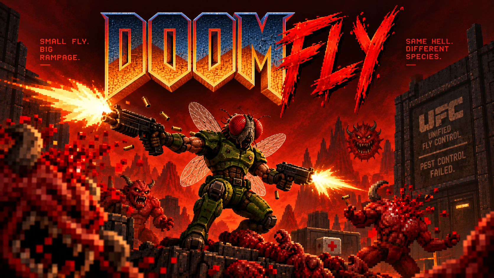
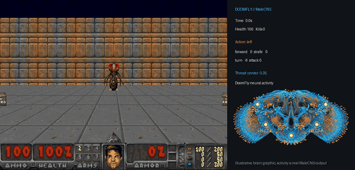

# DoomFly 🪰🔫

**Small fly. Big rampage.**

HHMI Janelia and Google Research released the [complete male fruit fly connectome](https://research.google/blog/a-connectomics-milestone-mapping-the-complete-male-fruit-fly-brain/). Everyone made it play Doom.

**We made it Doom Guy.**



## What DoomFly is

| | |
|---|---|
| 🧠 **Brain** | The full MaleCNS v1.0 connectome: **166,700 neurons, 25,582,938 connections**, nothing cropped |
| 👁️ **Eyes** | Every Doom frame drives 3,335 brightness and 811 color photoreceptor inputs |
| ⚠️ **Threat** | Enemy direction is injected into his LC4/LPLC2 looming neurons (see below) |
| 🔥 **Rage** | Demons switch on his five Tk-FruM neurons, a population linked to fly aggression |
| 🎮 **Hands** | A small PPO-trained controller reads 20 neural populations and picks: advance, turn, strafe, fire |

The wiring is real biology. The eye mapping, dynamics, threat input and controller are engineering choices.

**📖 [How it works — full method, results, controls and failures →](docs/how-it-works.md)**

## What's in here

```
media/      poster, gameplay clips, brain visual
docs/       how it works: method, results, caveats
results/    raw per-seed JSON, final report, negative results
src/doom/   simulator, native kernel, ViZDoom interface, controller
data-provenance/  dataset hashes and source lock
```

## Data

MaleCNS v1.0 — Janelia, Google Research, MRC LMB and the University of Cambridge.
Paper: [*Sexual dimorphism in the complete connectome of the Drosophila male central nervous system*, Cell (2026)](https://doi.org/10.1016/j.cell.2026.08.015)

Exact source URLs and SHA-256 digests: [`src/doom/datasets.json`](src/doom/datasets.json) and [`data-provenance/malecns_v1/source.lock.json`](data-provenance/malecns_v1/source.lock.json). The multi-GB connectome files are not stored here; the dataset registry tells you where to get them and what they should hash to.

## Running it

Python 3.11, a C++ compiler and several GB of RAM. It does not run in a browser.

```sh
python -m pip install -r requirements-neural.txt -r src/doom/requirements.txt
python -m doom.connectome malecns_v1
python -m doom.prepare
python -m doom.build_kernel
```

This repository holds the public release: media, documented results and the simulator and controller source. The trained v5 checkpoint is not included.

## License

Original DoomFly code is [MIT licensed](LICENSE). Data, game artwork and copied components keep their own licenses: see [THIRD_PARTY.md](THIRD_PARTY.md) and [THIRD_PARTY_NOTICES.md](THIRD_PARTY_NOTICES.md).

*DoomFly is a fan parody. It is not affiliated with, endorsed by, or sponsored by id Software, Bethesda or ZeniMax. No trademark rights are claimed.*
